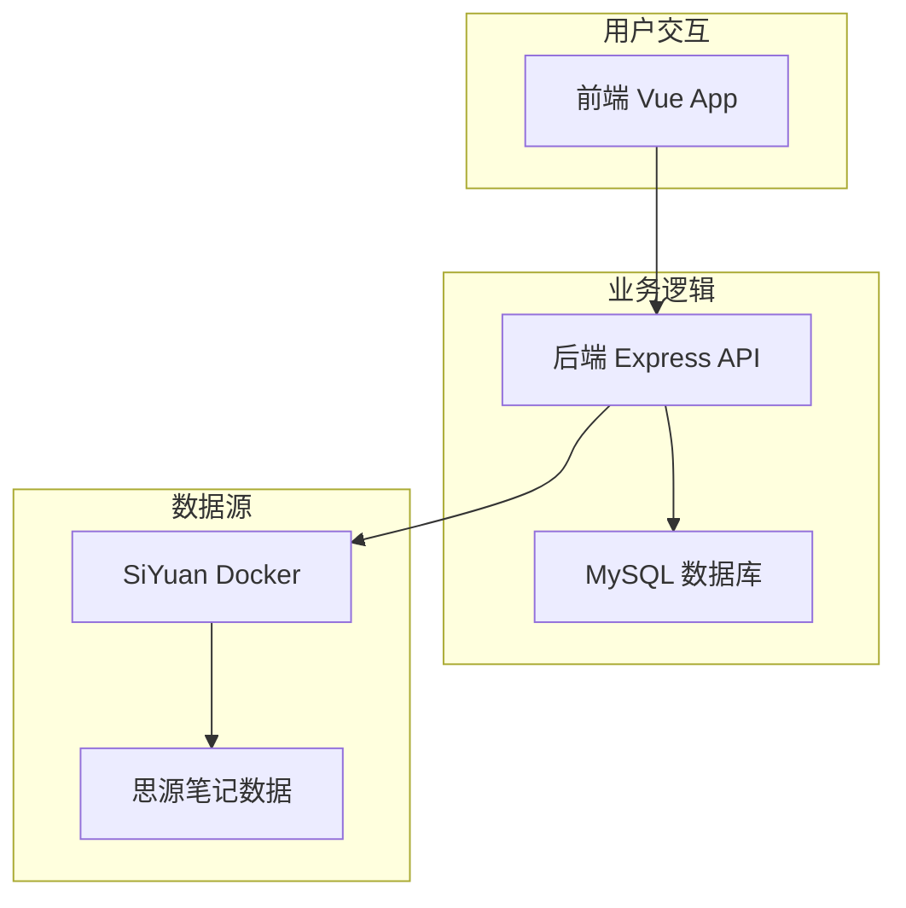

# SiyuanBlog - 思源笔记博客

> 轻松将思源笔记转换为个人博客网站

## ✨ 项目特色

- 🚀 **零迁移成本**：直接使用现有思源笔记作为数据源
- 📝 **所见即所得**：思源笔记的内容完美呈现为博客
- 🏷️ **智能筛选**：支持按标签、日期等多维度筛选
- 🐳 **容器化部署**：基于 Docker 的完整解决方案

## 🛠️ 技术栈

- **前端**：Vue + TypeScript + Yarn
- **后端**：Express + Yarn + MySQL + TypeORM  
- **笔记源**：SiYuan Docker

## 📐 技术架构



## 🚀 快速开始

### 环境要求

- Docker & Docker Compose
- Node.js >= 16（仅开发环境）
- MySQL >= 8.0（仅手动安装）

### 📁 项目结构

```
SiyuanBlog/
├── siyuan-blog-frontend/   # Vue 3 前端应用
├── siyuan-blog-backend/    # Express 后端 API
├── docker-compose.yml      # Docker 编排配置
├── env.example            # 环境变量示例
└── README.md              # 主项目文档
```

### 🐳 Docker 一键部署（推荐）

1. **克隆项目**
   ```bash
   git clone <repository-url>
   cd SiyuanBlog
   ```

2. **配置环境变量**
   ```bash
   cp env.example .env
   # 编辑 .env 文件，配置数据库密码和云同步参数
   ```

3. **启动所有服务**
   ```bash
   # 启动完整服务栈
   docker-compose up -d
   
   # 查看服务状态
   docker-compose ps
   
   # 查看日志
   docker-compose logs -f
   ```

4. **初始化数据库**
   ```bash
   # 等待 MySQL 启动完成，然后运行数据库迁移
   docker-compose exec backend yarn migration:run
   ```

5. **访问应用**
   - 前端 Web：http://localhost:3000
   - 后端 API：http://localhost:8000
   - SiYuan 笔记：http://localhost:6806
   - API 健康检查：http://localhost:8000/health

### 💻 本地开发模式

如果您想单独开发前端或后端：

1. **启动 SiYuan 和 MySQL**
   ```bash
   docker-compose up -d siyuan mysql
   ```

2. **开发前端**
   ```bash
   cd siyuan-blog-frontend
   yarn install
   yarn dev
   # 访问: http://localhost:3000
   ```

3. **开发后端**
   ```bash
   cd siyuan-blog-backend
   cp env.example .env
   yarn install
   yarn dev:ts
   # 访问: http://localhost:8000
   ```

### 📱 SiYuan 数据配置

#### 本地数据目录
默认创建新的工作空间，如需使用现有数据：

```bash
# 停止服务
docker-compose down

# 编辑 docker-compose.yml，修改 siyuan 服务的 volumes
# - ~/your-siyuan-data:/siyuan/workspace

# 重新启动
docker-compose up -d
```

#### 云端同步配置
在 `.env` 文件中配置：

```bash
# 思源官方云同步
SIYUAN_ACCESS_AUTH_CODE=your_access_code
SIYUAN_REPO_SYNC_CLOUD=your_cloud_repo_key
```

### 🌐 生产环境部署

1. **服务器环境准备**
   ```bash
   # 克隆项目到服务器
   git clone <repository-url>
   cd SiyuanBlog
   ```

2. **配置生产环境变量**
   ```bash
   cp env.example .env
   
   # 编辑生产环境配置
   vim .env
   ```
   
   重要配置项：
   ```bash
   # 安全的数据库密码
   MYSQL_ROOT_PASSWORD=your_secure_password
   
   # 云同步配置（可选）
   SIYUAN_ACCESS_AUTH_CODE=your_access_code
   SIYUAN_REPO_SYNC_CLOUD=your_cloud_repo_key
   ```

3. **启动生产服务**
   ```bash
   # 构建并启动所有服务
   docker-compose up -d
   
   # 初始化数据库
   docker-compose exec backend yarn migration:run
   
   # 检查服务状态
   docker-compose ps
   ```

4. **配置域名和 SSL（可选）**
   
   使用 Nginx 反向代理：
   ```nginx
   server {
       listen 80;
       server_name yourdomain.com;
       
       location / {
           proxy_pass http://localhost:3000;
           proxy_set_header Host $host;
           proxy_set_header X-Real-IP $remote_addr;
       }
       
       location /api {
           proxy_pass http://localhost:8000;
           proxy_set_header Host $host;
           proxy_set_header X-Real-IP $remote_addr;
       }
   }
   ```

#### 🔧 云同步配置

**思源官方云同步**：
1. 在思源客户端：设置 → 云端 → 数据同步
2. 复制访问授权码和仓库密钥到 `.env` 文件

**其他云存储**：
支持 S3、WebDAV 等，详见 [SiYuan 同步配置文档](https://github.com/siyuan-note/siyuan/blob/master/API.md)

#### 📊 监控和维护

```bash
# 查看服务日志
docker-compose logs -f

# 重启服务
docker-compose restart

# 更新服务
git pull
docker-compose up -d --build

# 备份数据
docker-compose exec mysql mysqldump -u root -p siyuan_blog > backup.sql
```

## 📋 主要功能

- **📚 笔记本管理**：自动同步思源笔记本结构
- **📝 文章展示**：完美渲染 Markdown 内容和代码高亮
- **🏷️ 智能筛选**：按标签、分类、日期多维度筛选
- **🔄 实时同步**：支持云端数据自动同步
- **📱 响应式设计**：完美适配桌面端和移动端
- **🐳 容器化部署**：一键 Docker 部署，开箱即用

## 🔗 相关链接

- **前端项目**: [详细文档](./siyuan-blog-frontend/README.md)
- **后端项目**: [详细文档](./siyuan-blog-backend/README.md)  
- **SiYuan 官网**: [https://b3log.org/siyuan/](https://b3log.org/siyuan/)
- **API 文档**: [SiYuan API](https://github.com/siyuan-note/siyuan/blob/master/API.md)

## 🤝 贡献指南

1. Fork 本项目
2. 创建功能分支 (`git checkout -b feature/amazing-feature`)
3. 提交更改 (`git commit -m 'Add amazing feature'`)
4. 推送分支 (`git push origin feature/amazing-feature`)
5. 创建 Pull Request

## 📄 许可证

MIT License

---

⭐ 如果这个项目对您有帮助，请给个 Star 支持一下！
