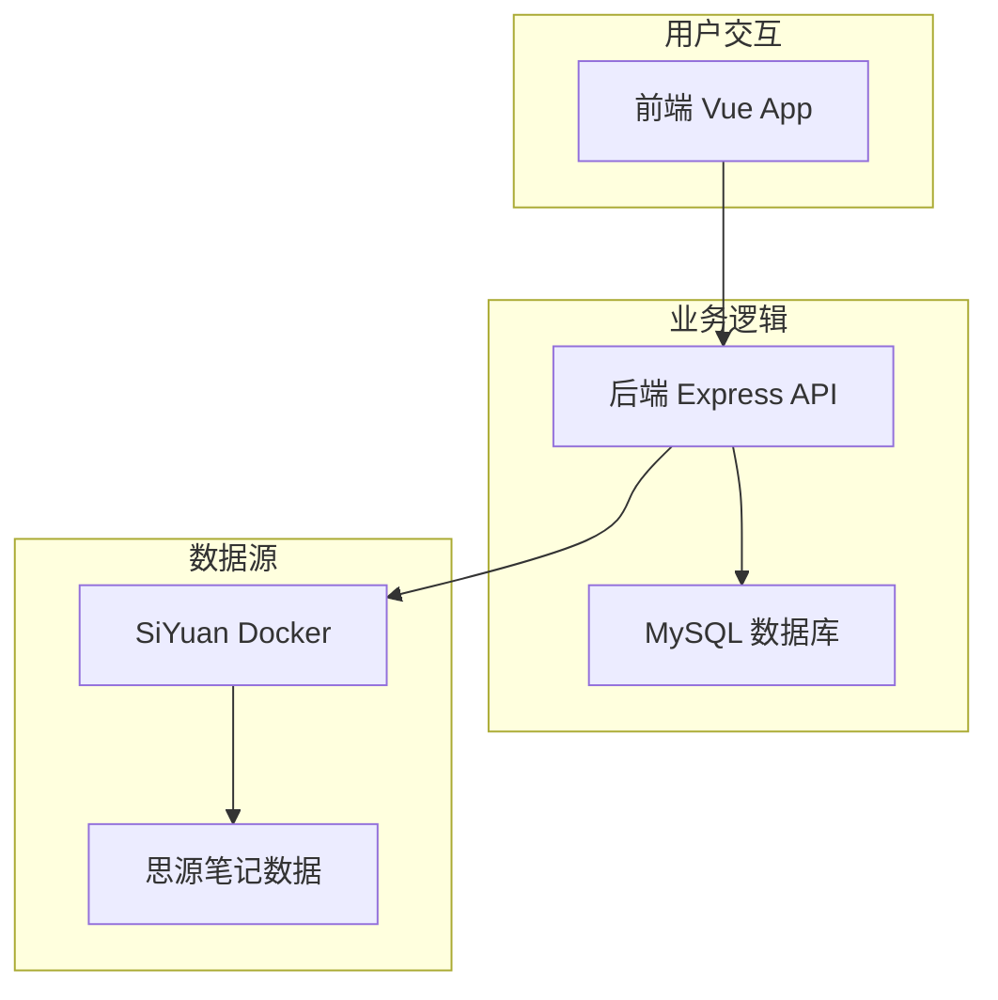

# SiyuanBlog - 思源笔记博客

> 轻松将思源笔记转换为个人博客网站

## ✨ 项目特色

- 🚀 **零迁移成本**：直接使用现有思源笔记作为数据源
- 📝 **所见即所得**：思源笔记的内容完美呈现为博客
- 🏷️ **智能筛选**：支持按标签、日期等多维度筛选
- 🐳 **容器化部署**：基于 Docker 的完整解决方案

## ��️ 技术栈

- **前端**：Vue 3 + TypeScript + Element Plus
- **后端**：Express + TypeScript + MySQL + TypeORM  
- **笔记源**：SiYuan Docker

## 📐 架构图



## 🚀 快速开始

### 环境要求

- Docker & Docker Compose
- Node.js >= 16（仅开发环境）

### 📁 项目结构

```
SiyuanBlog/
├── siyuan-blog-frontend/   # Vue 3 前端应用
├── siyuan-blog-backend/    # Express 后端 API
├── docker-compose.yml      # Docker 编排配置
├── env.example            # 环境变量示例
└── README.md              # 项目文档
```

### 🐳 一键部署

1. **克隆项目**
   ```bash
   git clone https://github.com/SourceKim/siyuan-blog.git
   cd SiyuanBlog
   ```

2. **配置环境变量**
   ```bash
   cp env.example .env
   
   # 编辑 .env 文件，根据需要配置：
   # - MYSQL_ROOT_PASSWORD: 数据库密码
   # - SIYUAN_DATA_PATH: 思源数据目录（可选）
   # - SIYUAN_TOKEN: 思源 API Token（可选）
   ```

3. **启动所有服务**
   ```bash
   docker-compose up -d
   
   # 查看服务状态
   docker-compose ps
   ```

4. **访问应用**
   - 博客前端：http://localhost:3000
   - 后端 API：http://localhost:8000
   - 思源笔记：http://localhost:6806

## 📝 思源数据配置

### 方法一：使用新的思源工作空间（默认）

默认会创建全新的思源工作空间，适合新用户：

```bash
# 1. 配置环境变量（使用默认值）
cp env.example .env
# SIYUAN_DATA_PATH 留空即使用 Docker volume

# 2. 启动服务
docker-compose up -d
```

### 方法二：使用现有的思源数据（推荐）

如果你已经有思源笔记数据，可以通过环境变量配置：

1. **找到你的思源数据目录**
   ```bash
   # macOS 常见位置
   ls ~/Documents/SiYuan
   ls ~/Library/Application\ Support/SiYuan
   
   # Windows 常见位置 (在 Git Bash 或 WSL 中)
   ls ~/Documents/SiYuan
   ls $APPDATA/SiYuan
   
   # Linux 常见位置
   ls ~/Documents/SiYuan
   ls ~/.config/SiYuan
   ```

2. **配置环境变量**
   ```bash
   cp env.example .env
   
   # 编辑 .env 文件，设置你的思源数据路径
   echo "SIYUAN_DATA_PATH=/Users/yourusername/Documents/SiYuan" >> .env
   
   # 或者使用相对路径（相对于项目根目录）
   echo "SIYUAN_DATA_PATH=../SiYuan" >> .env
   ```

3. **启动服务**
   ```bash
   docker-compose up -d
   
   # 验证数据加载正常
   curl http://localhost:6806/api/system/getConf
   ```

### 思源数据目录说明

**常见的思源数据位置**：
- **macOS**: `~/Documents/SiYuan` 或 `~/Library/Application Support/SiYuan`
- **Windows**: `%USERPROFILE%\Documents\SiYuan` 或 `%APPDATA%\SiYuan`
- **Linux**: `~/Documents/SiYuan` 或 `~/.config/SiYuan`

**目录结构示例**：
```
SiYuan/                    # 你的思源数据目录
├── conf/                  # 配置文件
├── data/                  # 笔记本数据
│   ├── 20240101090000-xxx/   # 笔记本1
│   └── 20240101100000-yyy/   # 笔记本2
├── emojis/               # 表情包
├── snippets/             # 代码片段
└── widgets/              # 挂件
```

**环境变量配置示例**：

```bash
# 绝对路径（推荐）
SIYUAN_DATA_PATH=/Users/kim/Documents/SiYuan

# 相对路径（相对于项目目录）
SIYUAN_DATA_PATH=../SiYuan

# 使用 Docker volume（默认，留空）
SIYUAN_DATA_PATH=

# Windows 路径示例（使用正斜杠）
SIYUAN_DATA_PATH=/c/Users/username/Documents/SiYuan
```

**配置验证**：
```bash
# 1. 检查配置是否生效
docker-compose config

# 2. 查看思源服务状态
docker-compose ps siyuan

# 3. 验证数据加载
curl http://localhost:6806/api/system/getConf
```

## 💻 本地开发

### 快速启动开发环境

```bash
# 1. 启动基础服务
docker-compose up -d siyuan mysql

# 2. 启动后端开发服务
cd siyuan-blog-backend
cp env.example .env.development
yarn install && yarn dev:ts

# 3. 启动前端开发服务（新终端）
cd siyuan-blog-frontend  
yarn install && yarn dev

# 访问：http://localhost:3000
```

**详细开发指南**：
- [后端开发文档](./siyuan-blog-backend/README.md) - Express API 开发
- [前端开发文档](./siyuan-blog-frontend/README.md) - Vue 应用开发

## 🔧 配置说明

### 环境变量

```bash
# 数据库配置
MYSQL_ROOT_PASSWORD=123456
MYSQL_DATABASE=siyuan_blog

# 思源同步配置（可选）
SIYUAN_ACCESS_AUTH_CODE=your_access_code
SIYUAN_REPO_SYNC_CLOUD=your_cloud_repo_key
```

### 思源 API Token 配置

1. 访问思源管理界面：http://localhost:6806
2. 设置 → 关于 → API token
3. 复制 token 到后端环境变量：
   ```bash
   echo "SIYUAN_TOKEN=your_token" >> siyuan-blog-backend/.env.development
   ```

## 📋 主要功能

- **📚 笔记本管理**：自动同步思源笔记本结构
- **📝 文章展示**：完美渲染 Markdown 内容
- **🏷️ 智能筛选**：按标签、分类、日期筛选
- **🔄 实时同步**：支持云端数据同步
- **📱 响应式设计**：适配各种设备

## 🌐 生产部署

### Docker 部署（推荐）

```bash
# 1. 配置生产环境变量
cp env.example .env
vim .env  # 设置安全的密码

# 2. 启动生产服务
docker-compose up -d

# 3. 配置域名和 SSL（可选）
# 使用 Nginx 反向代理
```

### 云同步配置

支持思源官方云同步、S3、WebDAV 等，详见 [SiYuan 同步文档](https://github.com/siyuan-note/siyuan/blob/master/API.md)

## 🔗 相关链接

- **项目地址**: https://github.com/SourceKim/siyuan-blog
- **SiYuan 官网**: https://b3log.org/siyuan/
- **API 文档**: https://github.com/siyuan-note/siyuan/blob/master/API.md

## 🤝 贡献

欢迎提交 Issue 和 Pull Request！

## 📄 许可证

MIT License

---

⭐ 如果这个项目对您有帮助，请给个 Star 支持一下！
