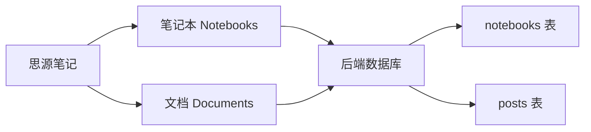
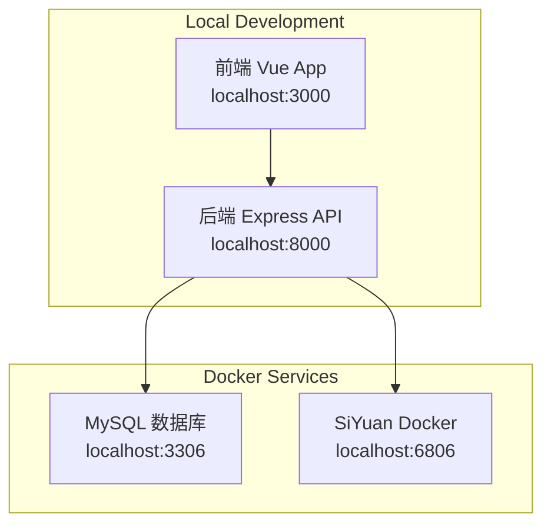

# SiYuan Blog Backend

> 基于 Express + TypeScript + TypeORM + MySQL 的思源笔记博客后端 API 服务

## 🚀 技术栈

- **框架**: Express.js
- **语言**: TypeScript
- **数据库**: MySQL 8.0
- **ORM**: TypeORM
- **包管理**: Yarn

## 📁 目录结构

```
siyuan-blog-backend/
├── src/
│   ├── controllers/       # 控制器
│   ├── services/         # 业务逻辑服务
│   ├── entities/         # 数据库实体
│   ├── repositories/     # 数据访问层
│   ├── routes/           # 路由配置
│   ├── middleware/       # 中间件
│   ├── utils/            # 工具函数
│   ├── types/            # TypeScript 类型定义
│   ├── config/           # 配置文件
│   ├── database/         # 数据库配置
│   ├── migrations/       # 数据库迁移
│   └── index.ts          # 应用入口
├── dist/                 # 编译输出
├── package.json          # 项目配置
├── tsconfig.json         # TypeScript 配置
├── env.example           # 环境变量示例
└── README.md            # 项目文档
```

## 🛠️ 本地开发指南

### 系统要求

- Node.js >= 16.0.0
- MySQL >= 8.0
- Yarn >= 1.22.0
- Docker & Docker Compose（推荐）

### 步骤 1：准备思源笔记服务

#### 方法一：使用 Docker 启动思源笔记（推荐）

```bash
# 在项目根目录，启动思源笔记和 MySQL 服务
cd ../  # 回到项目根目录
docker-compose up -d siyuan mysql

# 查看服务状态
docker-compose ps

# 访问思源笔记管理界面
# http://localhost:6806
```

#### 方法二：本地安装思源笔记

```bash
# 下载并安装思源笔记客户端
# https://github.com/siyuan-note/siyuan/releases

# 启动时开启 API 服务
./siyuan --port=6806 --api-server
```

### 步骤 2：配置环境变量

复制环境变量模板：

```bash
cp env.example .env.development
```

编辑 `.env.development` 文件：

```bash
# 服务器配置
PORT=8000
NODE_ENV=development

# SiYuan 配置（连接到 Docker SiYuan）
SIYUAN_API_URL=http://127.0.0.1:6806
SIYUAN_TOKEN=

# CORS 配置（允许前端访问）
CORS_ORIGIN=http://localhost:3000,http://localhost:5173

### 步骤 3：安装依赖

```bash
yarn install
```

### 步骤 5：启动开发服务器

```bash
# TypeScript 开发模式（推荐）
yarn dev:ts

# 或者编译后运行
yarn dev
```

服务启动后：
- API 服务：http://localhost:8000/api
- 健康检查：http://localhost:8000/health
- API 文档：http://localhost:8000/docs

### 步骤 6：验证思源连接

```bash
# 测试思源 API 连接
curl http://localhost:8000/api/siyuan/status

# 预期响应
{
  "success": true,
  "data": {
    "connected": true,
    "version": "2.x.x"
  }
}
```

### 步骤 7：初始化数据

```bash
# 同步思源笔记数据到数据库
curl -X POST http://localhost:8000/api/posts/sync

# 获取笔记本列表
curl http://localhost:8000/api/notebooks

# 获取文章列表
curl http://localhost:8000/api/posts
```

## 🔧 思源笔记配置详解

### SiYuan API 访问配置

1. **访问思源管理界面**：http://localhost:6806
2. **设置 → 关于 → API token**，复制 token 到 `.env.development`：
   ```bash
   SIYUAN_TOKEN=your_api_token_here
   ```
3. **重启后端服务**使配置生效

### 思源数据结构

后端会从思源笔记中同步以下数据：



### 支持的思源功能

- ✅ 笔记本列表获取
- ✅ 文档内容获取
- ✅ 文档属性读取（标签、创建时间等）
- ✅ Markdown 内容解析
- ✅ 块级引用解析
- 🔄 实时数据同步（开发中）
- 🔄 图片资源处理（开发中）

### 常见配置问题

**问题 1**：思源 API 连接失败
```bash
# 检查思源服务状态
docker-compose logs siyuan

# 检查端口是否开放
curl http://localhost:6806/api/system/getConf
```

**问题 2**：数据库连接失败
```bash
# 检查 MySQL 服务状态
docker-compose logs mysql

# 测试数据库连接
mysql -h127.0.0.1 -P3306 -uroot -p123456 -e "SELECT 1"
```

**问题 3**：环境变量不生效
```bash
# 确认环境文件存在
ls -la .env.development

# 检查应用是否正确加载环境变量
DEBUG=config:* yarn dev:ts
```

## 🌐 开发环境架构



## 📝 开发工作流

### 1. 日常开发流程

```bash
# 启动基础服务
docker-compose up -d siyuan mysql

# 启动后端开发服务
cd siyuan-blog-backend
yarn dev:ts

# 在新终端启动前端（可选）
cd ../siyuan-blog-frontend
yarn dev
```

### 2. 数据同步流程

```bash
# 在思源笔记中创建/修改内容
# 访问：http://localhost:6806

# 触发数据同步
curl -X POST http://localhost:8000/api/posts/sync

# 查看同步结果
curl http://localhost:8000/api/posts
```

### 3. 调试技巧

```bash
# 开启详细日志
DEBUG=app:*,siyuan:*,db:* yarn dev:ts

# 查看数据库内容
mysql -h127.0.0.1 -uroot -p123456 siyuan_blog -e "SELECT * FROM posts LIMIT 5"

# 监控 API 请求
tail -f logs/api.log
```

## 💾 数据库管理

### TypeORM 命令

```bash
# 生成新的迁移文件
yarn migration:generate src/migrations/CreatePostTable

# 运行迁移
yarn migration:run

# 回滚迁移
yarn migration:revert

# 删除数据库架构
yarn schema:drop
```

### 实体定义示例

```typescript
@Entity('posts')
export class Post {
  @PrimaryGeneratedColumn('uuid')
  id: string

  @Column({ length: 255 })
  title: string

  @Column('text')
  content: string

  @Column({ length: 500, nullable: true })
  excerpt: string

  @ManyToOne(() => Notebook, notebook => notebook.posts)
  notebook: Notebook

  @Column('json', { nullable: true })
  tags: string[]

  @CreateDateColumn()
  createdAt: Date

  @UpdateDateColumn()
  updatedAt: Date
}
```

## 🔗 SiYuan 集成

### API 配置

```typescript
export class SiYuanService {
  private apiUrl = config.siyuan.apiUrl
  private token = config.siyuan.token

  async getNotebooks(): Promise<Notebook[]> {
    const response = await axios.post(`${this.apiUrl}/api/notebook/lsNotebooks`, {
      token: this.token
    })
    return response.data.data
  }
}
```

### 数据同步流程

1. **连接 SiYuan API**
2. **获取笔记本列表**
3. **遍历文档树**
4. **解析 Markdown 内容**
5. **更新数据库记录**
6. **返回同步结果**

## 📦 Docker 部署

### Dockerfile

```dockerfile
FROM node:16-alpine AS build
WORKDIR /app
COPY package*.json ./
RUN yarn install
COPY . .
RUN yarn build

FROM node:16-alpine
WORKDIR /app
COPY --from=build /app/dist ./dist
COPY --from=build /app/node_modules ./node_modules
COPY package*.json ./
EXPOSE 8000
CMD ["node", "dist/index.js"]
```

### Docker Compose 示例

```yaml
version: '3.8'
services:
  backend:
    build: .
    ports:
      - "8000:8000"
    environment:
      - NODE_ENV=production
      - DB_HOST=mysql
    depends_on:
      - mysql
      
  mysql:
    image: mysql:8.0
    environment:
      - MYSQL_ROOT_PASSWORD=password
      - MYSQL_DATABASE=siyuan_blog
    volumes:
      - mysql_data:/var/lib/mysql

volumes:
  mysql_data:
```

## 🔧 开发工具

### 代码检查

```bash
# ESLint 检查
yarn lint

# 代码格式化
yarn format
```

### 调试

```bash
# 开启调试模式
DEBUG=app:* yarn dev:ts

# 使用 VS Code 调试器
# 在 .vscode/launch.json 中配置断点调试
```

### 测试

```bash
# 运行单元测试（待实现）
yarn test

# 运行集成测试（待实现）
yarn test:integration

# 生成测试覆盖率报告（待实现）
yarn test:coverage
```

## 🚀 部署

### 生产环境配置

1. **环境变量设置**
   ```bash
   export NODE_ENV=production
   export DB_HOST=your-mysql-host
   export DB_PASSWORD=your-secure-password
   ```

2. **构建应用**
   ```bash
   yarn build
   ```

3. **数据库迁移**
   ```bash
   yarn migration:run
   ```

4. **启动服务**
   ```bash
   yarn start
   ```

### PM2 部署

```bash
# 安装 PM2
npm install -g pm2

# 创建 ecosystem.config.js
module.exports = {
  apps: [{
    name: 'siyuan-blog-backend',
    script: 'dist/index.js',
    instances: 'max',
    exec_mode: 'cluster',
    env: {
      NODE_ENV: 'production',
      PORT: 8000
    }
  }]
}

# 启动应用
pm2 start ecosystem.config.js
```

### Nginx 反向代理

```nginx
server {
    listen 80;
    server_name api.yourdomain.com;

    location / {
        proxy_pass http://localhost:8000;
        proxy_http_version 1.1;
        proxy_set_header Upgrade $http_upgrade;
        proxy_set_header Connection 'upgrade';
        proxy_set_header Host $host;
        proxy_set_header X-Real-IP $remote_addr;
        proxy_set_header X-Forwarded-For $proxy_add_x_forwarded_for;
        proxy_set_header X-Forwarded-Proto $scheme;
        proxy_cache_bypass $http_upgrade;
    }
}
```

## 🐛 常见问题

### 数据库连接问题

**问题**: `ECONNREFUSED` 错误
**解决**: 
1. 检查 MySQL 服务是否启动
2. 验证数据库连接配置
3. 确认防火墙设置

### SiYuan API 连接问题

**问题**: SiYuan API 连接失败
**解决**:
1. 确认 SiYuan 服务运行在指定端口
2. 检查 API Token 配置
3. 验证网络连接

### TypeScript 编译问题

**问题**: 类型定义错误
**解决**:
1. 更新 `@types/*` 包
2. 检查 `tsconfig.json` 配置
3. 重新安装依赖

## 📚 相关文档

- [Express.js 官方文档](https://expressjs.com/)
- [TypeORM 官方文档](https://typeorm.io/)
- [TypeScript 官方文档](https://www.typescriptlang.org/)
- [MySQL 官方文档](https://dev.mysql.com/doc/)
- [SiYuan API 文档](https://github.com/siyuan-note/siyuan/blob/master/API.md)

## �� 许可证

MIT License 