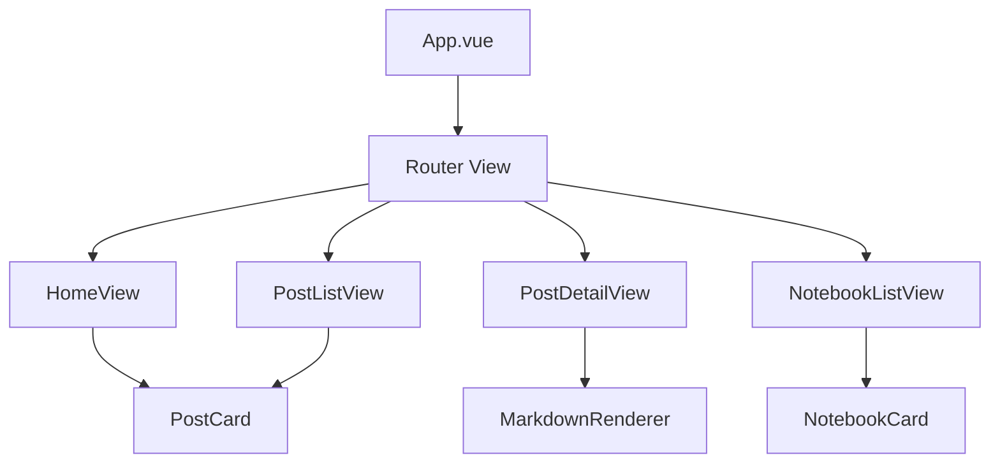

# SiYuan Blog Frontend

> 基于 Vue 3 + TypeScript + Element Plus 的思源笔记博客前端应用

## 🚀 技术栈

- **框架**: Vue 3 (Composition API)
- **语言**: TypeScript
- **构建工具**: Vite
- **UI 库**: Element Plus
- **状态管理**: Pinia
- **路由**: Vue Router 4
- **HTTP 客户端**: Axios
- **包管理**: Yarn

## 📁 目录结构

```
siyuan-blog-frontend/
├── public/                 # 静态资源
├── src/
│   ├── components/        # 公共组件
│   ├── views/            # 页面组件
│   ├── router/           # 路由配置
│   ├── stores/           # Pinia 状态管理
│   ├── services/         # API 服务
│   ├── utils/            # 工具函数
│   ├── types/            # TypeScript 类型定义
│   ├── assets/           # 资源文件
│   ├── App.vue           # 根组件
│   ├── main.ts           # 应用入口
│   └── style.css         # 全局样式
├── package.json          # 项目配置
├── vite.config.ts        # Vite 配置
├── tsconfig.json         # TypeScript 配置
└── README.md            # 项目文档
```

## 🛠️ 开发环境

### 系统要求

- Node.js >= 16.0.0
- Yarn >= 1.22.0

### 安装依赖

```bash
yarn install
```

### 启动开发服务器

```bash
# 开发模式运行
yarn dev

# 访问应用
# http://localhost:3000
```

### 构建生产版本

```bash
# 构建生产版本
yarn build

# 预览生产版本
yarn preview
```

### 代码检查和格式化

```bash
# ESLint 检查
yarn lint

# 代码格式化
yarn format

# TypeScript 类型检查
yarn type-check
```

## 🏗️ 项目架构

### 组件架构



### 状态管理

使用 Pinia 进行状态管理，主要 Store：

- **usePostsStore**: 文章数据管理
- **useNotebooksStore**: 笔记本数据管理
- **useAppStore**: 应用全局状态

### API 服务层

```typescript
// 示例 API 服务
export class PostService {
  static async getPosts(params: GetPostsParams) {
    return await api.get('/posts', { params })
  }
  
  static async getPost(id: string) {
    return await api.get(`/posts/${id}`)
  }
}
```

## 🔌 API 接口

### 基础配置

```typescript
// src/services/api.ts
const api = axios.create({
  baseURL: 'http://localhost:8000/api',
  timeout: 10000,
})
```

### 主要接口

| 接口 | 方法 | 说明 |
|------|------|------|
| `/posts` | GET | 获取文章列表 |
| `/posts/:id` | GET | 获取文章详情 |
| `/notebooks` | GET | 获取笔记本列表 |
| `/siyuan/status` | GET | SiYuan 连接状态 |

## 🎨 UI 设计

### 主题配置

支持明暗主题切换，使用 Element Plus 的 CSS 变量：

```css
/* 自定义主题变量 */
:root {
  --el-color-primary: #409eff;
  --el-color-success: #67c23a;
}
```

### 响应式设计

```css
/* 响应式断点 */
@media (max-width: 768px) {
  /* 移动端样式 */
}

@media (min-width: 769px) and (max-width: 1024px) {
  /* 平板端样式 */
}

@media (min-width: 1025px) {
  /* 桌面端样式 */
}
```

## 🔧 环境变量

在项目根目录创建 `.env` 文件：

```bash
# API 基础地址
VITE_API_BASE_URL=http://localhost:8000/api

# 应用标题
VITE_APP_TITLE=SiYuan Blog
```

## 📦 Docker 部署

### Dockerfile

```dockerfile
FROM node:16-alpine AS build
WORKDIR /app
COPY package*.json ./
RUN yarn install
COPY . .
RUN yarn build

FROM nginx:alpine
COPY --from=build /app/dist /usr/share/nginx/html
COPY nginx.conf /etc/nginx/nginx.conf
EXPOSE 80
CMD ["nginx", "-g", "daemon off;"]
```

### 构建和运行

```bash
# 构建镜像
docker build -t siyuan-blog-frontend .

# 运行容器
docker run -p 3000:80 siyuan-blog-frontend
```

## 🚀 部署

### 生产环境配置

1. **构建生产版本**
   ```bash
   yarn build
   ```

2. **配置 Nginx**
   ```nginx
   server {
     listen 80;
     server_name localhost;
     
     location / {
       root /usr/share/nginx/html;
       index index.html;
       try_files $uri $uri/ /index.html;
     }
     
     location /api {
       proxy_pass http://backend:8000;
       proxy_set_header Host $host;
       proxy_set_header X-Real-IP $remote_addr;
     }
   }
   ```

3. **部署到服务器**
   ```bash
   # 上传 dist 目录到服务器
   scp -r dist/ user@server:/var/www/html/
   ```

## 🐛 常见问题

### 开发环境问题

**问题**: `yarn dev` 启动失败
**解决**: 检查 Node.js 版本和端口占用

**问题**: API 请求 CORS 错误  
**解决**: 确保后端服务启动并配置了正确的 CORS

### 构建问题

**问题**: TypeScript 编译错误
**解决**: 运行 `yarn type-check` 检查类型错误

**问题**: 依赖包版本冲突
**解决**: 删除 `node_modules` 重新安装

## 🔄 开发流程

### Git 工作流

```bash
# 创建功能分支
git checkout -b feature/new-feature

# 提交代码
git add .
git commit -m "feat: 添加新功能"

# 推送分支
git push origin feature/new-feature

# 创建 Pull Request
```

### 代码规范

- 使用 ESLint + Prettier 进行代码检查和格式化
- 组件命名使用 PascalCase
- 函数命名使用 camelCase
- 常量命名使用 UPPER_SNAKE_CASE

## 📚 相关文档

- [Vue 3 官方文档](https://vuejs.org/)
- [Element Plus 文档](https://element-plus.org/)
- [Vite 文档](https://vitejs.dev/)
- [TypeScript 文档](https://www.typescriptlang.org/)

## �� 许可证

MIT License 