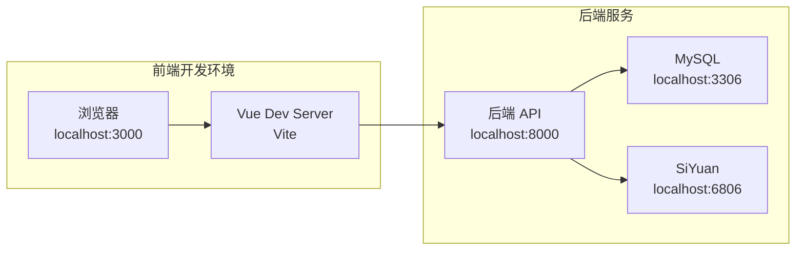
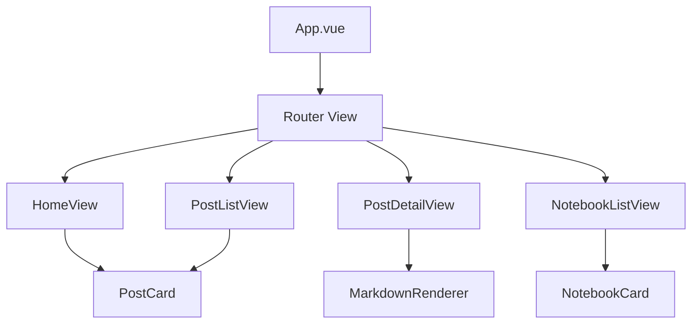

# SiYuan Blog Frontend

> 基于 Vue 3 + TypeScript + Element Plus 的思源笔记博客前端应用

## 🚀 技术栈

- **框架**: Vue 3 (Composition API)
- **语言**: TypeScript
- **构建工具**: Vite
- **UI 库**: Element Plus
- **状态管理**: Pinia
- **路由**: Vue Router 4
- **HTTP 客户端**: Axios
- **包管理**: Yarn

## 📁 目录结构

```
siyuan-blog-frontend/
├── public/                 # 静态资源
├── src/
│   ├── components/        # 公共组件
│   ├── views/            # 页面组件
│   ├── router/           # 路由配置
│   ├── stores/           # Pinia 状态管理
│   ├── services/         # API 服务
│   ├── utils/            # 工具函数
│   ├── types/            # TypeScript 类型定义
│   ├── assets/           # 资源文件
│   ├── App.vue           # 根组件
│   ├── main.ts           # 应用入口
│   └── style.css         # 全局样式
├── package.json          # 项目配置
├── vite.config.ts        # Vite 配置
├── tsconfig.json         # TypeScript 配置
└── README.md            # 项目文档
```

## 🛠️ 本地开发指南

### 系统要求

- Node.js >= 16.0.0
- Yarn >= 1.22.0

### 步骤 1：启动后端服务

前端需要连接到后端 API，请先确保后端服务已启动：

```bash
# 在项目根目录，启动后端依赖的服务
cd ../ # 回到项目根目录
docker-compose up -d siyuan mysql

# 启动后端 API 服务
cd siyuan-blog-backend
yarn dev:ts

# 确认后端服务运行正常
curl http://localhost:8000/health
```

### 步骤 2：配置环境变量

在前端项目根目录创建环境变量文件：

```bash
# 创建开发环境配置
cp .env.example .env.development.local

# 或者直接创建 .env.local 文件
cat > .env.local << EOF
# API 基础地址
VITE_API_BASE_URL=http://localhost:8000/api

# 应用标题
VITE_APP_TITLE=SiYuan Blog

# 开发模式配置
VITE_DEV_MODE=true
EOF
```

### 步骤 3：安装依赖

```bash
yarn install
```

### 步骤 4：启动开发服务器

```bash
# 开发模式运行
yarn dev

# 访问应用
# http://localhost:3000
```

### 步骤 5：验证前后端连接

```bash
# 打开浏览器开发者工具，检查网络请求
# 访问：http://localhost:3000

# 或者测试 API 连接
curl http://localhost:3000
```

## 🔌 API 连接配置详解

### 基础配置

```typescript
// src/services/api.ts
import axios from 'axios'

const api = axios.create({
  baseURL: import.meta.env.VITE_API_BASE_URL || 'http://localhost:8000/api',
  timeout: 10000,
  headers: {
    'Content-Type': 'application/json',
  }
})

// 请求拦截器
api.interceptors.request.use(
  (config) => {
    console.log('API Request:', config.method?.toUpperCase(), config.url)
    return config
  },
  (error) => {
    console.error('Request Error:', error)
    return Promise.reject(error)
  }
)

// 响应拦截器
api.interceptors.response.use(
  (response) => {
    console.log('API Response:', response.status, response.config.url)
    return response
  },
  (error) => {
    console.error('Response Error:', error.response?.status, error.config?.url)
    return Promise.reject(error)
  }
)

export default api
```

### 主要接口服务

```typescript
// src/services/posts.ts
export class PostService {
  static async getPosts(params: GetPostsParams = {}) {
    const response = await api.get('/posts', { params })
    return response.data
  }
  
  static async getPost(id: string) {
    const response = await api.get(`/posts/${id}`)
    return response.data
  }
  
  static async syncPosts() {
    const response = await api.post('/posts/sync')
    return response.data
  }
}

// src/services/notebooks.ts
export class NotebookService {
  static async getNotebooks() {
    const response = await api.get('/notebooks')
    return response.data
  }
  
  static async getNotebook(id: string) {
    const response = await api.get(`/notebooks/${id}`)
    return response.data
  }
}
```

### 环境变量说明

| 变量名 | 说明 | 默认值 | 示例 |
|--------|------|--------|------|
| `VITE_API_BASE_URL` | 后端 API 基础地址 | `http://localhost:8000/api` | `https://api.yourdomain.com/api` |
| `VITE_APP_TITLE` | 应用标题 | `SiYuan Blog` | `我的思源博客` |
| `VITE_DEV_MODE` | 开发模式开关 | `false` | `true` |

### 开发环境网络架构



## 🎨 开发工作流

### 1. 完整启动流程

```bash
# 终端 1：启动基础服务
cd SiyuanBlog
docker-compose up -d siyuan mysql

# 终端 2：启动后端
cd siyuan-blog-backend
yarn dev:ts

# 终端 3：启动前端
cd siyuan-blog-frontend
yarn dev

# 浏览器访问：http://localhost:3000
```

### 2. 常用开发命令

```bash
# 代码检查和格式化
yarn lint          # ESLint 检查
yarn format        # Prettier 格式化
yarn type-check    # TypeScript 类型检查

# 构建相关
yarn build         # 构建生产版本
yarn preview       # 预览生产版本
```

### 3. 调试技巧

```bash
# 开启详细日志
VITE_LOG_LEVEL=info yarn dev

# 查看网络请求
# 浏览器 F12 → Network 选项卡

# 查看状态管理
# 浏览器 Vue DevTools
```

## 🔧 常见开发问题

### 问题 1：API 请求 CORS 错误

**现象**：
```
Access to XMLHttpRequest at 'http://localhost:8000/api/posts' from origin 'http://localhost:3000' has been blocked by CORS policy
```

**解决方案**：
```bash
# 检查后端 CORS 配置
# 确保后端 .env.development 文件中包含：
CORS_ORIGIN=http://localhost:3000,http://localhost:5173
```

### 问题 2：API 请求连接失败

**现象**：
```
Network Error: connect ECONNREFUSED 127.0.0.1:8000
```

**解决方案**：
```bash
# 1. 确认后端服务已启动
curl http://localhost:8000/health

# 2. 检查前端 API 地址配置
cat .env.local | grep VITE_API_BASE_URL

# 3. 重启前端开发服务
yarn dev
```

### 问题 3：热重载不工作

**解决方案**：
```bash
# 清除缓存重新启动
rm -rf node_modules/.vite
yarn dev
```

### 问题 4：TypeScript 类型错误

**解决方案**：
```bash
# 运行类型检查
yarn type-check

# 重新生成类型定义
rm -rf node_modules/@types
yarn install
```

## 🏗️ 项目架构

### 组件架构



### 状态管理

使用 Pinia 进行状态管理，主要 Store：

```typescript
// src/stores/posts.ts
export const usePostsStore = defineStore('posts', () => {
  const posts = ref<Post[]>([])
  const loading = ref(false)
  
  const fetchPosts = async (params?: GetPostsParams) => {
    loading.value = true
    try {
      const response = await PostService.getPosts(params)
      posts.value = response.data.posts
    } catch (error) {
      console.error('Failed to fetch posts:', error)
    } finally {
      loading.value = false
    }
  }
  
  return { posts, loading, fetchPosts }
})
```

### 路由配置

```typescript
// src/router/index.ts
const routes = [
  { path: '/', component: HomeView },
  { path: '/posts', component: PostListView },
  { path: '/posts/:id', component: PostDetailView },
  { path: '/notebooks', component: NotebookListView },
]
```

## 🎨 UI 设计

### 主题配置

支持明暗主题切换，使用 Element Plus 的 CSS 变量：

```css
/* src/style.css */
:root {
  --el-color-primary: #409eff;
  --el-color-success: #67c23a;
  --blog-header-height: 60px;
  --blog-sidebar-width: 260px;
}

/* 暗色主题 */
.dark {
  --el-bg-color: #1a1a1a;
  --el-text-color-primary: #e5eaf3;
}
```

### 响应式设计

```css
/* 响应式断点 */
@media (max-width: 768px) {
  .blog-container {
    flex-direction: column;
  }
  
  .blog-sidebar {
    width: 100%;
    height: auto;
  }
}

@media (min-width: 769px) and (max-width: 1024px) {
  .blog-sidebar {
    width: 200px;
  }
}
```

### 构建生产版本

```bash
# 构建生产版本
yarn build

# 预览生产版本
yarn preview
```

## 🔧 环境变量

在项目根目录创建 `.env` 文件：

```bash
# API 基础地址
VITE_API_BASE_URL=http://localhost:8000/api

# 应用标题
VITE_APP_TITLE=SiYuan Blog
```

## 📦 Docker 部署

### Dockerfile

```dockerfile
FROM node:16-alpine AS build
WORKDIR /app
COPY package*.json ./
RUN yarn install
COPY . .
RUN yarn build

FROM nginx:alpine
COPY --from=build /app/dist /usr/share/nginx/html
COPY nginx.conf /etc/nginx/nginx.conf
EXPOSE 80
CMD ["nginx", "-g", "daemon off;"]
```

### 构建和运行

```bash
# 构建镜像
docker build -t siyuan-blog-frontend .

# 运行容器
docker run -p 3000:80 siyuan-blog-frontend
```

## 🚀 部署

### 生产环境配置

1. **构建生产版本**
   ```bash
   yarn build
   ```

2. **配置 Nginx**
   ```nginx
   server {
     listen 80;
     server_name localhost;
     
     location / {
       root /usr/share/nginx/html;
       index index.html;
       try_files $uri $uri/ /index.html;
     }
     
     location /api {
       proxy_pass http://backend:8000;
       proxy_set_header Host $host;
       proxy_set_header X-Real-IP $remote_addr;
     }
   }
   ```

3. **部署到服务器**
   ```bash
   # 上传 dist 目录到服务器
   scp -r dist/ user@server:/var/www/html/
   ```

## 🐛 常见问题

### 开发环境问题

**问题**: `yarn dev` 启动失败
**解决**: 检查 Node.js 版本和端口占用

**问题**: API 请求 CORS 错误  
**解决**: 确保后端服务启动并配置了正确的 CORS

### 构建问题

**问题**: TypeScript 编译错误
**解决**: 运行 `yarn type-check` 检查类型错误

**问题**: 依赖包版本冲突
**解决**: 删除 `node_modules` 重新安装

## 🔄 开发流程

### Git 工作流

```bash
# 创建功能分支
git checkout -b feature/new-feature

# 提交代码
git add .
git commit -m "feat: 添加新功能"

# 推送分支
git push origin feature/new-feature

# 创建 Pull Request
```

### 代码规范

- 使用 ESLint + Prettier 进行代码检查和格式化
- 组件命名使用 PascalCase
- 函数命名使用 camelCase
- 常量命名使用 UPPER_SNAKE_CASE

## 📚 相关文档

- [Vue 3 官方文档](https://vuejs.org/)
- [Element Plus 文档](https://element-plus.org/)
- [Vite 文档](https://vitejs.dev/)
- [TypeScript 文档](https://www.typescriptlang.org/)

## �� 许可证

MIT License 